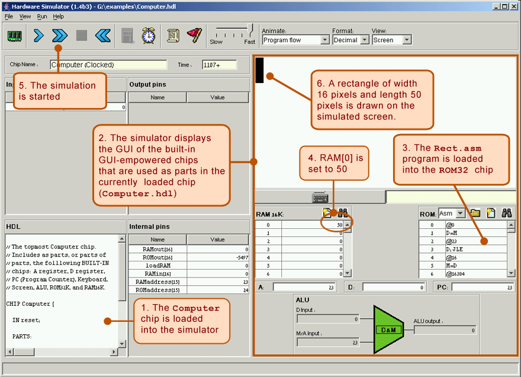

# Computer Architecture

https://www.nand2tetris.org/project05

------

## Background

In previous projects we've built the computer's basic processing and storage devices (ALU and RAM, respectively). In this project we will put everything together, yielding the complete *Hack* Hardware Platform. The result will be a general-purpose computer that can run programs written in the *Hack* machine language.

## Objective

Complete the construction of the *Hack* CPU and the *Hack* hardware platform, leading up to the top-most `Computer` chip.

## Chips

|   Chip Name    |         Description          |                           Testing                            |
| :------------: | :--------------------------: | :----------------------------------------------------------: |
|  `Memory.hdl`  |   Entire RAM address space   | Test your chip using the supplied `Memory.tst` and `Memory.cmp` files. |
|   `CPU.hdl`    |        The *Hack* CPU        | Test your chip using the supplied `CPU.tst` and `CPU.cmp` files. Alternative test files (less thorough but do not require using the built-in `DRegister`) are supplied in `CPU-external.tst` and `CPU-external.cmp`. |
| `Computer.hdl` | The platform's top-most chip | Test by running some *Hack* programs on the constructed chip. See more instructions below. |

## Contract

The computer platform that you build should be capable of executing programs written in the *Hack* machine language, specified in *Chapter 4*. Demonstrate this capability by having your `Computer` chip run the three test programs given below.

## Testing

**Testing the `Memory` and `CPU` chips:** It's important to unit-test these chips before proceeding to build the overall `Computer` chip. Use the the test scripts and compare files listed above.

**Testing the `Computer` chip:** A natural way to test the overall `Computer` chip implementation is to have it execute some sample programs written in the *Hack* machine language. In order to perform such a test, one can write a test script as follows:

1. Loads the `Computer.hdl` chip description into the supplied *Hardware Simulator*.
2. Loads a machine-level program from an external `.hack` file into the ROM chip-part of the loaded `Computer.hdl` chip.
3. Runs the clock enough cycles to execute the loaded instructions.

We supply all the files necessary to run three such tests, as follows:

|   Program   |                           Comments                           |
| :---------: | :----------------------------------------------------------: |
| `Add.hack`  | Adds up the two constants 2 and 3 and writes the result in `RAM[0]`. Recommended test: `ComputerAdd.tst` and `ComputerAdd.cmp`. Alternative test (less thorough but only requires usage of the built-in `RAM16K`): `ComputerAdd-external.tst` and `ComputerAdd-external.cmp`. |
| `Max.hack`  | Computes the maximum of `RAM[0]` and `RAM[1]` and writes the result in `RAM[2]`. Recommended test: `ComputerMax.tst` and `ComputerMax.cmp`. Alternative test (less thorough but only requires usage of the built-in `RAM16K`): `ComputerMax-external.tst` and `ComputerMax-external.cmp`. |
| `Rect.hack` | Draws a rectangle of width 16 pixels and length `RAM[0]` at the top left of the screen. Recommended tests: `testComputerRect.tst` and `ComputerRect.cmp`. Alternative test (less thorough but does not require usage of any built-in chips): `ComputerRect-external.tst` and `ComputerRect-external.cmp`. |

Before testing your `Computer` chip on any one of the above programs, read the relevant `.tst` file and be sure to understand the instructions given to the simulator. *Appendix B* of the book may be a useful reference here.

## Resources

The relevant reading for this project are *Chapter 5*, *Appendix A*, and *Appendix B* (as a reference). Specifically, all the chips described in *Chapter 5* should be implemented in the Hardware Description Language (HDL) specified in *Appendix A*.

The resources that you need for this project are the supplied *Hardware Simulator* and the files listed above. If you've downloaded the *Nand2Tstris* Software Suite, these files are stored in your `projects/05` directory.

## Implementation Tips

Complete the computer's construction in the following order:

**Memory:** This chip includes three chip-parts: `RAM16K`, `Screen`, and `Keyboard`. The `Screen` and the `Keyboard` are available as built-in chips, and thus there is no need to implement them. Although the `RAM16K` chip was built in *Project 3*, we recommend using its built-in version, as it provides a debugging-friendly GUI.

**CPU:** This chip can be constructed according to the proposed CPU implementation given in *Figure 5.9* of *Chapter 5*, using the ALU and register chips built in *Projects 2* and *3*, respectively. We recommend though using built-in chip-parts instead, in particular `ARegister` and `DRegister`. The built-in versions of these two chips have exactly the same interface and functionality as those of the `Register` chip specified in *Chapter 3*; however, they feature GUI side-effects that come handy for testing purposes.

In principle, your CPU implementation may include internal chips of your own specification, i.e. chips not mentioned in *Figure 5.9* of *Chapter 5*. However, this is not recommended, and will most likely yield a less efficient CPU design. If you choose to create new chips not mentioned in the book, be sure to document and unit-test them carefully before you plug them into the architecture.

**Instruction memory:** Use the built-in `ROM32K` chip.

**Computer:** The top-most `Computer` chip can be constructed according to the proposed implementation shown in *Figure 5.10* of *Chapter 5*.

## Tools

All the chips mentioned in this project, including the topmost `Computer` chip, can be implemented and tested using the supplied *Hardware Simulator*. Here is a screen shot of testing the `Rect.hack` program on a `Computer` chip implementation.

The `Rect` program illustrated above draws a rectangle of width 16 pixels and length `RAM[0]` at the top-left of the screen. Now here is an interesting observation: normally, when you run a program on some computer, and you don't get the desired result, you conclude that the program is buggy. In our case though, the supplied `Rect` program is bug-free. Thus, if running this program yields unexpected results, it means that the computer platform on which it runs (`Computer.hdl` and/or some of its lower-level chip parts) is buggy. If that is the case, you have to debug your chips.

------

*© 2017 Shimon Schocken and Noam Nisan*