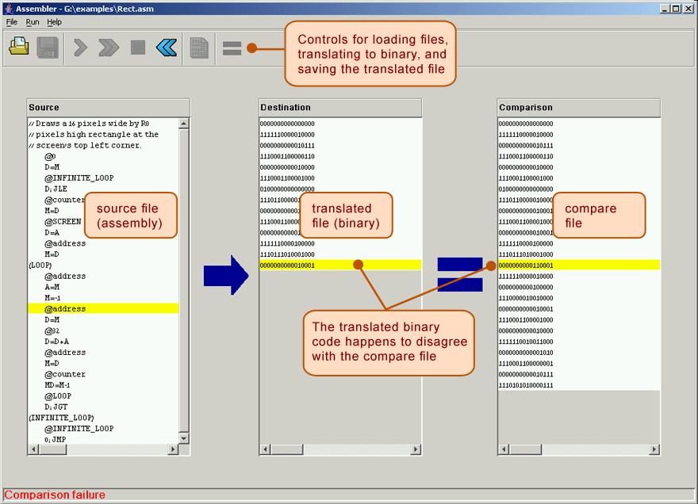

# The Assembler

https://www.nand2tetris.org/project06

------

## Background

Low-level machine programs are rarely written by humans. Typically, they are generated by compilers. Yet humans can inspect the translated code and learn important lessons about how to write their high-level programs better, in a way that avoids low-level pitfalls and exploits the underlying hardware better. One of the key players in this translation process is the assembler -- a program designed to translate code written in a symbolic machine language into code written in binary machine language.

This project marks an exciting landmark in our *Nand2Tstris* odyssey: it deals with building the first rung up the software hierarchy, which will eventually end up in the construction of a compiler for a Java-like high-level language. But, first things first.

## Objective

Write an *Assembler* program that translates programs written in the symbolic *Hack* assembly language into binary code that can execute on the *Hack* hardware platform built in the previous projects.

## Contract

There are three ways to describe the desired behavior of your assembler:

- When loaded into your assembler, a `Prog.asm` file containing a valid *Hack* assembly language program should be translated into the correct *Hack* binary code and stored in a `Prog.hack` file.
- The output produced by your assembler must be identical to the output produced by the *Assembler* supplied with the *Nand2Tetris* Software Suite.
- Your assembler must implement the translation specification given in *Chapter 6*, *Section 2*.

## Usage

Depending on the programming language that you use, the assembler should be invoked using something like "`Assembler fileName.asm`", where the string `fileName.asm` is the assembler's input, i.e. the name of a text file containing *Hack* assembly commands. The assembler creates an output text file named `fileName.hack`. Each line in the output file consists of sixteen 0 and 1 characters. The output file is stored in the same directory of the input file. The name of the input file may contain a file path.

## Resources

The relevant reading for this project is *Chapter 6*. Your assembler implementation can be written in any programming language (Java and Python being popular choices). Two useful tools are the supplied *Assembler* and the supplied *CPU Emulator*, both available in your tools directory. These tools allow experimenting with a working assembler before setting out to build one yourself. In addition, the supplied assembler provides a visual line-level translation GUI, and allows code comparisons with the outputs that your assembler will generate. For more information about these capabilities, refer to the supplied *Assembler Tutorial*.

## Proposed Implementation

*Chapter 6* includes a proposed, language-independent Assembler API, which can serve as your implementation's blueprint. We suggest building the assembler in two stages:

1. Write a basic assembler designed to translate assembly programs that contain no symbols.
2. Extend your basic assembler with symbol handling capabilities, yielding the final assembler. The test programs that we supply below are designed to support this staged implementation strategy.

## Test Programs

Each test program except the first one comes in two versions: `Prog.asm` is an assembly program; `ProgL.asm` is the very same program, Less the symbols (each symbol is replaced with an explicit memory address).

| Symbolic Program | Without Symbols |                         Description                          |
| :--------------: | :-------------: | :----------------------------------------------------------: |
|    `Add.asm`     |                 |  Adds up the constants 2 and 3 and puts the result in `R0`.  |
|    `Max.asm`     |   `MaxL.asm`    |      Computes `max(R0,R1)` and puts the result in `R2`.      |
|    `Rect.asm`    |   `RectL.asm`   | Draws a rectangle at the top-left corner of the screen. The rectangle is 16 pixels wide and `R0` pixels high. |
|    `Pong.asm`    |   `PongL.asm`   | A single-player *Pong* game. A ball bounces off the screen's "*walls*". The player attempts to hit the ball with a paddle by pressing the left and right arrow keyboard keys. For each successful hit, the player gains one point and the paddle shrinks a little, to make the game slightly more challenging. If the player misses the ball, the game is over. To quit the game, press the <kbd>ESC</kbd> key. |

**The *Pong* program** supplied above was written in the Java-like high-level *Jack* language and translated into the *Hack* assembly language by the *Jack* compiler (*Jack* and the *Jack* compiler are described in *Chapter 9* and in *Chapters 10-11*, respectively). Although the original *Jack* program is only about 300 lines of *Jack* code, the executable *Pong* code is naturally much longer. Running this interactive program in the supplied *CPU Emulator* is a slow affair, so don't expect a high-powered *Pong* game. This slowness is actually a virtue, since it enables your eye to track the graphical behavior of the program. And don't worry! as we continue to build the software platform in the next few projects, *Pong* and and other games will run much faster.

## Tools

The supplied ***Hack Assembler*** shown below is guaranteed to generate correct binary code. This guaranteed performance can be used to test if another assembler, say the one written by you, also generates correct code. The following screen shot illustrates the comparison process:

**The comparison logic:** Let `Prog.asm` be some program written in the symbolic *Hack* assembly language. Suppose we translate this program using the supplied *Assembler*, producing a binary file called `Prog.hack`. Next, we use another assembler (e.g. the one that you wrote) to translate the same program into another file, say `MyProg.hack`. Now, if the latter assembler is working correctly, it follows that `Prog.hack` equals `MyProg.hack`. Thus, one way to test a newly written assembler is as follows:

1. Load into the supplied visual assembler `Prog.asm` as a source program and `MyProg.hack` as a compare file.
2. Translate the source program.
3. Compare the resulting binary code with the compare file (see the figure above). If the comparison fails, the assembler that generated `MyProg.hack` must be buggy; otherwise, it may be OK.

------

*© 2017 Shimon Schocken and Noam Nisan*